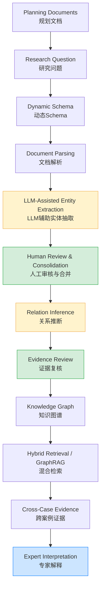
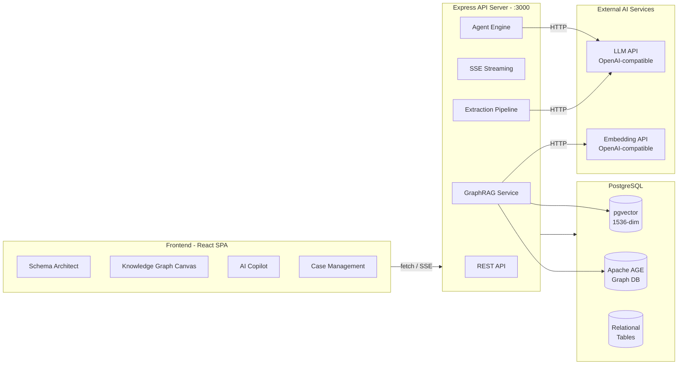

# Urban CaseFlow

<p align="center">
  <strong>A human–AI framework for structuring, comparing, and mobilizing urban planning case knowledge</strong><br>
  <sub>structured · comparable · traceable · human-supervised · context-sensitive</sub>
</p>

<p align="center">
  
  
  
  
</p>

---

## Overview

Urban planning routinely confronts complex, context-dependent problems. Planning knowledge includes not only formal rules, standards, and procedures, but also experiential insights accumulated through prior projects, policies, and local practices. This case-based knowledge typically resides in unstructured narrative forms — planning reports, policy documents, research papers, and project descriptions — making systematic comparison, retrieval, and reuse difficult.

Urban CaseFlow is a **research prototype** that supports the knowledge-mobilization process through which prior planning experience is structured, reviewed, retrieved, compared, and brought to bear on current analysis. It is neither an automated planning system nor a decision-making tool. The system assists rather than replaces expert judgment.

Urban CaseFlow 是一个面向城市规划案例知识结构化与调用的研究原型系统，重点支持规划经验从非结构化文本到可比较、可检索、可追溯知识图谱的转化过程。

---

## Research Motivation

In planning reasoning, **rule-based knowledge** (regulations, codes, formal procedures) and **case-based knowledge** (contextual experience, stakeholder interactions, implementation adaptations, outcomes) are complementary. While formal rules are relatively straightforward to encode, the contextual richness of planning cases — actors, strategies, institutional conditions, spatial settings, and outcomes — remains embedded in narrative descriptions. This asymmetry limits systematic learning from prior planning experience.

Urban CaseFlow concentrates on a specific step in the knowledge lifecycle: **making implicit experiential knowledge embedded in planning narratives structurally explicit, comparable, and retrievable**, while preserving the institutional and regulatory context within which each case is situated. The system does not attempt to unify or replace rule-based and case-based reasoning paradigms; it provides infrastructure for case knowledge mobilization that must always be interpreted by domain experts.

---

## Conceptual Workflow



**Yellow nodes** indicate AI-generated content. **Green nodes** indicate human-in-the-loop review steps. **Blue** represents final expert interpretation, which is always the responsibility of the domain expert, not the system.

---

## Core Capabilities

Each capability is verified against the current codebase. Features not yet implemented are listed under [Roadmap](#roadmap).

### Dynamic Schema Architect
Users define entity types, properties, and relation types specific to a research question. The schema constrains downstream extraction and is configurable per project. A visual designer (ReactFlow) shows the schema structure. AI can suggest schemas from natural language descriptions, which experts then review and modify.

**Input:** Research question, domain knowledge.<br>
**Output:** JSON schema with entity types, properties, and relation definitions.<br>
**Human role:** Define, review, and approve the schema before extraction begins.

### Document and Case Management
Create cases, upload planning documents (PDF, DOCX, TXT; max 10MB), and manage case metadata. Documents are parsed into text segments for downstream processing.

### LLM-Assisted Entity Extraction
AI extracts entities from case text according to the active schema. The system supports both single-pass (chat mode) and multi-round extraction pipeline (pipeline mode). The extraction pipeline processes all entity types in parallel with chunked re-read for long documents.

**Input:** Case text + schema definition.<br>
**Output:** Candidate entities with suggested entity type, properties, and source evidence.<br>
**Human role:** Review, correct, approve, or reject each candidate entity.

### Entity Review and Consolidation
Candidates are presented for expert review. Reviewers can approve, skip, edit, or merge entities. A consistency-checking agent suggests deduplication of similar or duplicate entities. Batch operations support approving or skipping multiple entities at once.

**Input:** Candidate entity list.<br>
**Output:** Approved entity set with resolved duplicates.<br>
**Human role:** All approval, modification, and merge decisions.

### Relation Inference and Validation
After entities are confirmed, the system infers candidate relations between them using the schema's relation type definitions. Each candidate relation includes a confidence score and evidence citation. Relations flagged as low-confidence or connecting critical entities should receive particularly careful expert review.

**Input:** Approved entities + schema relation definitions.<br>
**Output:** Candidate relations with confidence scores and source evidence.<br>
**Human role:** Review and approve or reject each candidate relation. Relations do not imply causal mechanisms; they indicate co-occurrence or institutional association patterns that require expert interpretation.

### Source Evidence and Traceability
Every extracted entity records the text segments from which it was derived (`source_segment_ids`). Relation candidates include evidence fields. Users can view original text segments alongside candidates during review.

### Knowledge Graph Exploration
Interactive 2D force-directed graph visualization. Features include full-text node search, entity type filtering, focus mode, path analysis between two entities, neighbor expansion by depth, and graph export (GraphML, CSV, JSON).

### Cross-Case Evidence and Case Recommendation
The system computes case similarity using three signals: graph-structure similarity (Jaccard over shared concept neighbors in Apache AGE), case-level vector similarity, and entity-type distribution similarity. A built-in recommendation endpoint returns structurally related cases. The GraphRAG analysis assistant can contextualize why cases are similar.

**Important:** Structural similarity between cases does **not** mean that interventions or strategies are directly transferable. Similarity scores reflect shared entities and relational patterns in the knowledge graph, which must be interpreted against local spatial, institutional, regulatory, governance, and political conditions.

### Hybrid Retrieval and GraphRAG
The system combines vector search (pgvector, 1536-dimension embeddings), PostgreSQL full-text search (GIN indexes), and graph expansion (Apache AGE k-hop traversal) via Reciprocal Rank Fusion. The analysis assistant agent uses this hybrid retrieval context to ground its responses in your knowledge base, citing specific entities, relations, and cases.

### Export
Export individual cases or all cases in JSON, CSV, or GraphML format for external analysis, GIS integration, or publication.

---

## System Architecture



---

## Quick Start

### Prerequisites

- Node.js 18+
- PostgreSQL 16+ with [pgvector](https://github.com/pgvector/pgvector) extension
- [Apache AGE](https://age.apache.org/) extension (required for graph traversal and case recommendation)
- An OpenAI-compatible API key (any provider with `/v1/chat/completions` and `/v1/embeddings`)

### Installation

```bash
git clone https://github.com/Hturbo312/caseflow.git
cd caseflow

# Install frontend dependencies
npm install

# Install server dependencies
cd server
npm install
cd ..
```

### Database Setup

```bash
createdb knowledge_graph
psql knowledge_graph -c "CREATE EXTENSION IF NOT EXISTS vector;"
psql knowledge_graph -c "CREATE EXTENSION IF NOT EXISTS age;"
```

**Note:** The database name `knowledge_graph` is currently hardcoded. The database is auto-initialized on first server start — all tables, indexes, and default agents are created by `initializeDatabase()`.

### Configuration

```bash
cp server/.env.example server/.env
```

Edit `server/.env`:

```env
AI_API_KEY=your-api-key
AI_ENDPOINT=https://api.openai.com/v1/chat/completions
AI_MODEL=gpt-4o
AI_EMBEDDING_ENDPOINT=https://api.openai.com/v1/embeddings
AI_EMBEDDING_MODEL=text-embedding-3-small
```

The embedding model must produce **1536-dimensional** vectors.

### Start

```bash
# Terminal 1: Backend (port 3000)
cd server
npm run dev

# Terminal 2: Frontend (port 5173)
npm run dev
```

Open `http://localhost:5173` and navigate to the CaseFlow application.

---

## Suggested First Run

1. **Create or select a Schema** — Use the Schema Architect in the left panel to define entity types and relations for your research question, or use the AI Schema Builder agent to suggest one.
2. **Create a Case** — Click the + button in the case panel to create a new case and upload a planning document (PDF, DOCX, or TXT).
3. **Run entity extraction** — In the AI Copilot (case_extractor agent), start the extraction pipeline. The system will parse the document, generate an extraction plan, and extract candidate entities per type.
4. **Review entities** — In the Entities tab, review each candidate: approve correct entities, skip or edit incorrect ones, merge duplicates.
5. **Infer relations** — After approving entities, run relation inference. The system proposes candidate relations based on the schema.
6. **Review relations** — Examine each candidate relation, check its confidence score and evidence, and approve or reject.
7. **Explore the graph** — Switch to the Graph view to explore entities and relations visually. Use search, path analysis, and filtering.
8. **Query the knowledge base** — Use the Analysis Assistant agent to ask questions. The system retrieves relevant entities and relations using GraphRAG and generates a response grounded in your knowledge base.
9. **Export** — Export cases in GraphML, CSV, or JSON format.

---

## Project Structure

```
caseflow/
├── src/
│   ├── pages/CaseFlow/              # Main application
│   │   └── components/
│   │       ├── SchemaArchitect/     # Domain model designer (7 components)
│   │       ├── KnowledgeGraphCanvas/# Graph visualization + interaction
│   │       ├── AICopilot/           # AI agents + extraction pipeline
│   │       └── CaseManagement/      # Case CRUD + detail views
│   ├── store/                       # Zustand state management
│   ├── services/                    # API client layer
│   ├── hooks/                       # Shared React hooks
│   ├── utils/                       # Utility functions (doc parser, etc.)
│   └── i18n/                        # Internationalization (EN/ZH)
├── server/
│   ├── index.js                     # Server entry point
│   ├── init.js                      # DB initialization + agent definitions
│   ├── config.js                    # Configuration
│   ├── db.js                        # Database connection
│   ├── routes/                      # 11 API route modules
│   │   ├── auth.js, schemas.js, cases.js, agents.js
│   │   ├── extraction.js, rag.js, graphRag.js, chat.js
│   │   ├── ai.js, graphs.js, health.js
│   ├── services/                    # Business logic
│   │   ├── agent.js                 # AI agent engine (callAI, callAIStream, agent loop)
│   │   ├── extractionPipeline.js    # Multi-round extraction pipeline
│   │   └── graphRag.js              # GraphRAG hybrid retrieval
│   ├── middleware/                   # Auth + async handler
│   └── generate_embeddings.js       # Batch embedding script
├── testdata/                        # Sample documents (2 files)
├── docs/                            # Documentation
└── public/                          # Static assets
```

---

## Research Scope and Limitations

This is a **research prototype** developed to support academic investigation of human–AI collaboration in urban planning knowledge work. The following limitations should be understood before using or citing the system:

1. **LLM output requires expert review.** AI-generated entities, relations, and analyses may contain errors, omissions, or hallucinations. All AI output is presented as *candidates* that must be reviewed, corrected, and approved by domain experts before being saved to the knowledge graph.

2. **Graph relations do not equal causal mechanisms.** Relations in the knowledge graph reflect co-occurrence patterns, institutional associations, or implementation linkages identified by AI from text. They do not, by themselves, prove causal mechanisms. Expert interpretation is required to assess whether an observed relational pattern reflects a meaningful planning mechanism.

3. **Structural similarity does not imply transferability.** The case recommendation system identifies structurally similar cases based on shared entities and relational patterns. Similarity scores are computed from graph topology, vector proximity, and entity-type distributions. Two cases being structurally similar does not mean that interventions from one can be directly applied to another. Applicability must be assessed against local spatial, institutional, regulatory, governance, and political conditions.

4. **The system does not replace planning expertise.** Urban CaseFlow is designed to make case knowledge more structured, comparable, and retrievable. It does not automate planning decisions, evaluate plan quality, or recommend specific planning actions.

5. **Current operational limitations:**
   - The database connection is hardcoded (database name `knowledge_graph`, user `postgres`, Unix socket `/var/run/postgresql`). See `server/db.js`.
   - No Docker or containerized deployment is provided.
   - The embedding dimension is fixed at 1536. Using a model with a different dimension requires code changes.
   - PDF parsing quality varies with document structure. Scanned documents without OCR will produce empty results.
   - The system has been tested with Chinese and English planning documents. Performance with other languages is unverified.
   - No rate limiting or production security hardening is applied. The default JWT secret is unsuitable for production.

6. **Not suitable for production deployment without additional hardening.** Authentication, authorization, rate limiting, and secure configuration management should be reviewed and strengthened before any deployment beyond a controlled research environment.

---

## Reproducibility and Citation

This repository accompanies an academic paper. For detailed information on reproducing the experiments described in the paper — including dataset descriptions, schema definitions, LLM models and parameters, system prompts, extraction procedures, human review protocols, and evaluation methods — see [`docs/REPRODUCIBILITY.md`](docs/REPRODUCIBILITY.md).

The paper is currently under development. Citation information will be added upon publication.

```
@article{urban-caseflow,
  title   = {Urban CaseFlow: A Human-AI Framework for Structuring and Mobilizing Urban Planning Case Knowledge},
  author  = {[Authors]},
  journal = {[Journal]},
  year    = {[Year]},
  doi     = {[DOI]}
}
```

---

## Roadmap

Features not yet implemented but planned or under consideration:

- [ ] Docker Compose for one-command setup
- [ ] CI/CD pipeline and automated testing
- [ ] Benchmark scripts and evaluation framework
- [ ] Public dataset with documented provenance
- [ ] GIS data import/export (GeoJSON, Shapefile)
- [ ] Timeline and geospatial visualization views
- [ ] Improved source evidence — span-level text highlighting
- [ ] Multilingual extraction beyond EN/ZH
- [ ] Schema versioning and migration management
- [ ] Plugin interface for custom entity extractors
- [ ] Authentication hardening and role-based access control
- [ ] Centralized prompt management (extract prompts from code into versioned files)

---

## Contributing

Contributions are welcome. Areas of particular interest include:

- Domain templates for additional urban planning sub-fields
- Evaluation datasets and benchmarks
- Documentation improvements
- Bug reports and reproducibility testing

1. Fork the repository
2. Create a feature branch (`git checkout -b feature/your-feature`)
3. Commit your changes
4. Push and open a Pull Request

---

## License

MIT License. See [LICENSE](LICENSE) for details.

**Note:** A LICENSE file is in the process of being added. The server `package.json` currently declares ISC; this will be unified to MIT.

---

## Acknowledgments

- [React Flow](https://reactflow.dev/) — schema visualization
- [react-force-graph](https://github.com/vasturiano/react-force-graph) — knowledge graph rendering
- [Zustand](https://github.com/pmndrs/zustand) — state management
- [Apache AGE](https://age.apache.org/) — graph database extension
- [pgvector](https://github.com/pgvector/pgvector) — vector similarity search
- [Framer Motion](https://www.framer.com/motion/) — UI animations

---

## Additional Documentation

- [`docs/USER_GUIDE.md`](docs/USER_GUIDE.md) — End-to-end user guide
- [`docs/REPRODUCIBILITY.md`](docs/REPRODUCIBILITY.md) — Paper reproducibility
- [`docs/case-recommendation-demo.md`](docs/case-recommendation-demo.md) — Case recommendation demo transcript
